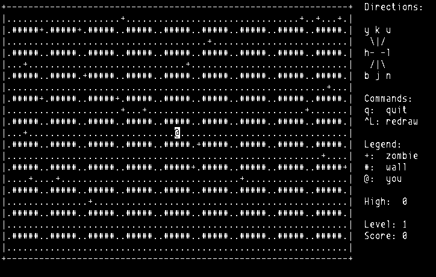

=======
Zombies
=======

*Kill off the zombies!*

.. contents:: **Contents**
   :local:

History
=======

From ``zombies(6)``:

  Krem at RMIT wrote the original version on a Cyber in Pascal. Hopefully this
  is close to the original version - the Unix(tm) version was written from
  happy memories only...

According the comments in source codes, Simon Burge developed this version
since 1994. On 1999-06-26, `version 1.0`_ was released.

.. _version 1.0: https://bitbucket.org/livibetter/zombies/commits/tag/v0.1.0

In November, 2015, `Grandpa's Code`_ attempted to continue the work. As of
December, 2015, it conforms to C99 and POSIX.1-2001.

.. _Grandpa's Code: https://bitbucket.org/grandpas/code

Copyright
=========

Zombies is licensed under the Simplified BSD License (2-clause), see
|COPYING|_.

.. |COPYING| replace:: ``COPYING``
.. _COPYING: COPYING
